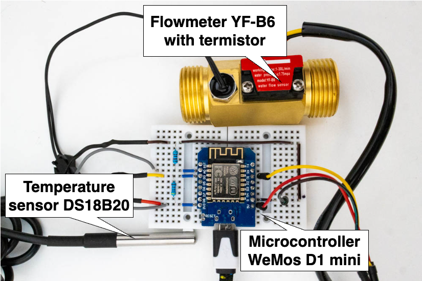

# SmartBoiler Add-On for Home Assistant

# SMART BOILER
This is a README for the Smart Boiler Home Assistant Add-On, used to decrease energy usage for heating water in a boiler. This is achieved by learning household consumption trends and heating water above the emergency temperature just before predicted consumption.
This uses a smartboiler library: <https://github.com/grinwi/smart_boiler>.
Recursive link to the GitHub repository: <https://github.com/grinwi/smartboiler-add-on> .

## What's it all about?
This project was undertaken as a master's thesis at FIT VUT Brno. 
The goal was to find a solution for cutting costs by predicting household inhabitants' behavior with machine learning. Machine learning was utilized to train an LSTM network on historical data from a smart home. 
Based on the prediction of heat consumption from the water boiler, the algorithm included in controller.py achieves a reduction in the average temperature of the water in the boiler, lowering energy losses, and the energy needed to deliver heat into the boiler.

This solution assumes that the user has a boiler whose heating can be controlled by a Shelly smart plug <https://www.shelly.com/en/products/shop/shelly-plus-1-pm>.


Another requirement is a Home Assistant instance running in the required household with:
- an InfluxDB database, which stores household data,
- as well as weather information from Accu Weather <https://www.home-assistant.io/integrations/accuweather> , 
- the presence of devices in local network via NMAP <https://www.home-assistant.io/integrations/nmap_tracker/> integration,
- temperature sensor placed inside the boiler casing to control the heating based on the water temperature in the boiler. For this can be used a Dallas DS18B20 connected to the same microcontroller board as...
- ...the flow meter with a temperature sensor placed on the output of the boiler, for which can be used for example YF-B6 with a thermistor. 




Users can also utilize their Google Calendar to turn off the heating, for example, when they are on holiday. Another function using the calendar is heating to a needed temperature when unusually high consumption is expected. This can be achieved by copying Google calendar API token as ```token.json``` to ```/app``` folder of the Add-On retrieved by this manual: <https://developers.google.com/calendar/api/guides/overview>

The Home Assistant Add-On repository can be found at this address: <https://github.com/grinwi/smartboiler-add-on>.

[](https://my.home-assistant.io/redirect/supervisor_add_addon_repository/?repository_url=https%3A%2F%2Fgithub.com%2Fhome-assistant%2Faddons-example)

###
For measuring the flow and temperature on the output of the boiler and temperature in the case of the boiler can be used following config for the device in ESPHome:

```
esphome:
  name: ESP_DEVICE_NAME
  friendly_name: ESP_DEVICE_FRIENDLY_NAME

esp8266:
  board: TYPE_OF_THE_BOARD

# Enable logging
logger:
  level: DEBUG
dallas:
  - pin: PIN_OF_THE_DALLAS_SENSOR
    update_interval: 10s

# Individual sensors
sensor:
  - platform: dallas
    address: 0x803c01d6077ec328
    name: "tmp_boiler_case"


  - platform:  ntc
    sensor:  resistance_sensor
    id: ntc_sensor
    name:  NTC Temperature B Constant
    calibration:
      b_constant: 3950
      reference_temperature: 25°C
      reference_resistance: 50kOhm

  - platform:  resistance
    id:  resistance_sensor
    sensor:  source_sensor
    configuration:  UPSTREAM
    resistor:  51kOhm
    reference_voltage:  3.3V
    name:  Resistance Sensor
    
  - platform:  adc
    id:  source_sensor
    filters:
      -  multiply: 3.3
      -  offset: -0.042
    pin:  A0
    update_interval:  10s
  - platform: pulse_counter
    pin: D1
    unit_of_measurement: 'L/min'
    id: water_usage
    name: 'Current water usage'
    update_interval: 5s
    filters:
      - lambda: return (x / 396); # 396 = 6,6 * 60

  - platform: integration
    name: "Total Water Usage"
    unit_of_measurement: 'L'
    sensor: water_usage
    time_unit: min
    
  - platform: integration
    name: "Total Water MC"
    unit_of_measurement: 'mc'
    sensor: water_usage
    time_unit: min
    filters:
      - lambda: return (x / 1000);

  - platform: wifi_signal
    name: "${friendly_name} Wifi "
    update_interval: 60s

# Enable Home Assistant API
api:
  encryption:
    key: KEY

ota:


wifi:
  ssid: !secret wifi_ext_ssid
  password: !secret wifi_password
  # Enable fallback hotspot (captive portal) in case wifi connection fails
  ap:
    ssid: SSID
    password: PASSWORD

captive_portal:
    
```

### Buy me a coffee
<a href="https://buymeacoffee.com/smartboiler" target="_blank"></a>


### Smartboiler add-on

![Supports aarch64 Architecture][aarch64-shield]
![Supports amd64 Architecture][amd64-shield]
![Supports armhf Architecture][armhf-shield]
![Supports armv7 Architecture][armv7-shield]


[aarch64-shield]: https://img.shields.io/badge/aarch64-yes-green.svg
[amd64-shield]: https://img.shields.io/badge/amd64-yes-green.svg
[armhf-shield]: https://img.shields.io/badge/armhf-yes-green.svg
[armv7-shield]: https://img.shields.io/badge/armv7-yes-green.svg
