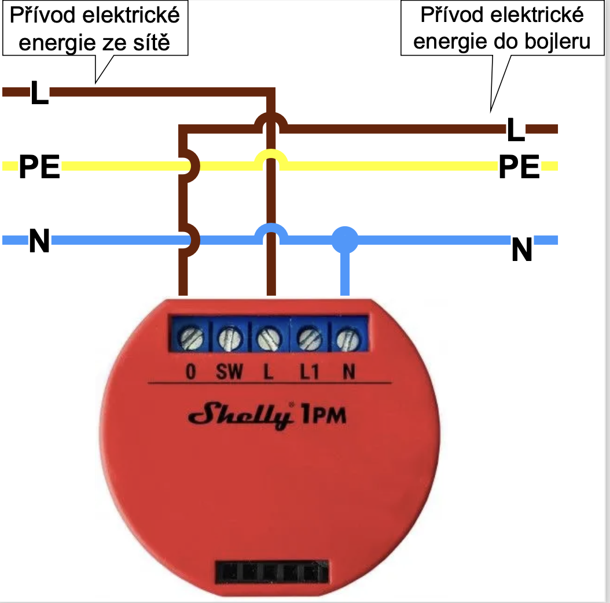
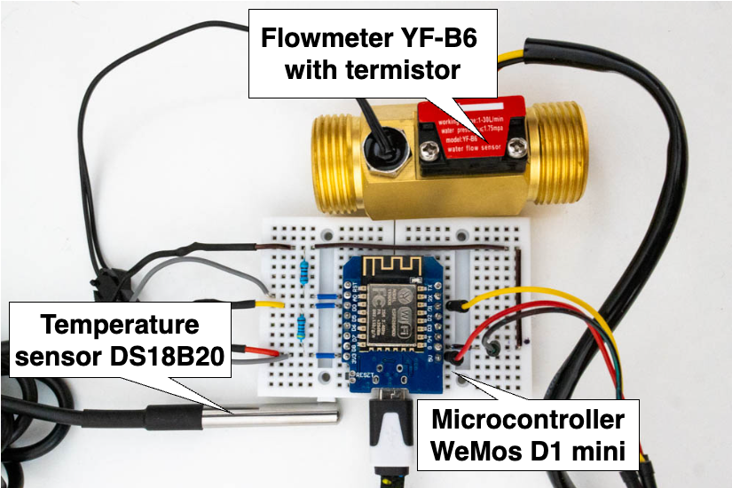

# SmartBoiler Add-on — Setup & Configuration Guide

SmartBoiler v2.0 is configured entirely through the built-in **web UI wizard** — no YAML editing required.
This guide walks through hardware setup, installation, and all configuration options with examples.

---

## Table of Contents

1. [Hardware Requirements](#1-hardware-requirements)
2. [Installation](#2-installation)
3. [Setup Wizard Walkthrough](#3-setup-wizard-walkthrough)
4. [Configuration Reference](#4-configuration-reference)
5. [Example Configurations](#5-example-configurations)
6. [Sensor Wiring & ESPHome](#6-sensor-wiring--esphome)
7. [Calendar Events](#7-calendar-events)
8. [Dashboard](#8-dashboard)
9. [Troubleshooting](#9-troubleshooting)

---

## 1. Hardware Requirements

### Minimum (works without any sensors)

| Component | Notes |
|-----------|-------|
| Home Assistant | Any installation (HA OS, Container, Core) |
| Smart relay in HA | Controls boiler power; any HA-switchable relay works |

With no sensors the system controls heating based purely on time-of-use pricing and HDO schedule.
Consumption prediction falls back to the global average until enough data is collected.

### Recommended

| Component | Purpose | HA entity type |
|-----------|---------|----------------|
| **Shelly Plus 1PM** (or similar with power monitoring) | Relay control + HDO detection via power reading | `switch.*`, `sensor.*.power` |
| NTC thermistor inside boiler casing | Direct water temperature → most accurate control | `sensor.*` |
| ESPHome flow meter (YF-B6) + DS18B20 outlet thermistor | Accurate hot-water consumption metering | `sensor.*` |
| PV inverter integration | Solar surplus scheduling | `sensor.*` (W or kWh) |
| HA Person tracker / device tracker | Presence (optional, improves prediction) | `person.*` / `device_tracker.*` |

### Shelly Plus 1PM Wiring

Connect the Shelly Plus 1PM in series with the boiler power supply (L wire):

```
        ┌─────────────────────────────────────────────┐
        │  Distribution Board                         │
        │  ┌──────────┐                              │
        │  │  Breaker │ 16 A                         │
        │  └────┬─────┘                              │
        │       │ L                                   │
        │  ┌────▼──────────────────────┐             │
        │  │   Shelly Plus 1PM         │             │
        │  │  ┌───┐  ┌────────────┐   │             │
        │  │  │ I │  │     O      │   │             │
        │  └──┴─┬─┴──┴────┬───────┘   │             │
        │        │          │           │             │
        └────────┼──────────┼───────────┘             │
                 │ L_in     │ L_out                   │
                 │          └──────────────► Boiler    │
                 │ N ──────────────────────► Boiler    │
                 │ PE ─────────────────────► Boiler    │
```



After wiring, add the Shelly to your Wi-Fi network and integrate it with HA using the [Shelly integration](https://www.home-assistant.io/integrations/shelly/).

---

## 2. Installation

### Step 1 — Add the repository

In Home Assistant: **Settings → Add-ons → Add-on Store → ⋮ → Repositories**

Add: `https://github.com/grinwi/smartboiler-add-on`

### Step 2 — Install the add-on

Search for **Smart Boiler** in the add-on store and click **Install**.
The first install downloads ~200 MB of dependencies; subsequent updates are faster.

### Step 3 — Start the add-on

Click **Start**. Check the **Log** tab — you should see:
```
[INFO] SmartBoiler starting...
[INFO] No configuration found at /data/smartboiler_setup.json — setup wizard required.
[INFO] Dashboard starting on port 8099
```

### Step 4 — Open the setup wizard

Click **Open Web UI** (or navigate to the add-on's ingress URL).
You will be redirected to the setup wizard automatically.

---

## 3. Setup Wizard Walkthrough

The wizard has five sections. All fields marked **required** must be filled; all others are optional and can be left at their defaults.

### Section 1: Boiler

| Field | Required | Description |
|-------|----------|-------------|
| Boiler switch entity | ✅ | The HA entity that turns boiler heating on/off (e.g. `switch.boiler_shelly`) |
| Boiler power sensor | ✗ | Power reading entity in watts (e.g. `sensor.boiler_shelly_power`) — enables HDO auto-detection and L2 temperature estimation |
| Boiler capacity | ✅ | Tank volume in litres (e.g. `100`) |
| Boiler wattage | ✅ | Heater power in watts (e.g. `2000`) |
| Set temperature | ✅ | Thermostat target in °C (e.g. `60`) |
| Minimum temperature | ✅ | Minimum acceptable water temp in °C (e.g. `38`) — heating is triggered before this is reached |
| Area temperature | ✅ | Ambient temperature around the boiler (e.g. `20`) — used for standby loss calculation |

### Section 2: Temperature Sensing

| Field | Required | Description |
|-------|----------|-------------|
| Direct water temp sensor | ✗ | NTC probe inside boiler (e.g. `sensor.boiler_ntc`) — best accuracy |
| Case temperature sensor | ✗ | Sensor on boiler casing (e.g. `sensor.boiler_case_temp`) — used for thermal model |
| Ambient temperature entity | ✗ | Room thermometer near boiler (e.g. `sensor.utility_room_temp`) |

### Section 3: Consumption Metering

| Field | Required | Description |
|-------|----------|-------------|
| Water flow sensor | ✗ | Flow rate in L/min (e.g. `sensor.boiler_flow`) |
| Outlet water temperature | ✗ | Hot water outlet temp in °C (e.g. `sensor.boiler_outlet_temp`) |
| Inlet (cold) water temperature | ✗ | Cold water inlet temp in °C, or leave blank for fixed 10 °C |

These three together enable the most accurate consumption metering via `Q = ṁ × c_p × ΔT`.
If not configured, the system falls back to relay on-time estimation (rougher but functional).

### Section 4: Energy Optimisation

| Field | Required | Description |
|-------|----------|-------------|
| Enable spot prices | ✗ | Toggle — enables day-ahead electricity price scheduling |
| Spot price region | ✗ | Country code: `CZ` / `SK` / `AT` / `DE` / `PL` / `HU` / `FR` / `IT` / `ES` |
| HDO explicit schedule | ✗ | Known HDO blocking times (e.g. `22:00-06:00,12:05-13:35`). Leave blank to use auto-learning. |
| Has PV system | ✗ | Toggle — enables solar surplus prioritisation |
| PV power entity | ✗ | Current PV output in W (e.g. `sensor.solaredge_ac_power`) |
| PV surplus entity | ✗ | Direct surplus reading if available (e.g. `sensor.pv_to_grid`) |
| PV installed capacity | ✗ | Peak power in kWp — used for forecast-based surplus estimation |
| Has battery | ✗ | Toggle — enables battery-aware PV allocation |
| Battery capacity | ✗ | Total capacity in kWh |
| Battery SoC entity | ✗ | Current state of charge in % or kWh |
| Battery max charge rate | ✗ | Maximum charge power in kW (0 = unlimited) |
| Battery priority | ✗ | `battery_first` / `boiler_first` / `sell_first` |

### Section 5: Prediction & Behaviour

| Field | Required | Description |
|-------|----------|-------------|
| Prediction conservatism | ✗ | `low` (p50) / `medium` (p75, default) / `high` (p90) — how cautiously to predict consumption |
| Minimum training days | ✗ | Days of data before switching from global fallback to per-slot predictions (default: 30) |
| Vacation minimum temperature | ✗ | Floor temperature during `vacation_min` / `vacation_off` calendar events (default: 20 °C) |
| Person entity IDs | ✗ | Comma-separated person entities for presence tracking (e.g. `person.alice,person.bob`) |

Click **Save** — the controller starts immediately and the dashboard will be visible.

---

## 4. Configuration Reference

All configuration is stored in `/data/smartboiler_setup.json`. You do not need to edit this file manually — use the setup wizard. But for reference:

```json
{
  "boiler_switch_entity_id": "switch.boiler_shelly",
  "boiler_power_entity_id": "sensor.boiler_shelly_power",
  "boiler_direct_tmp_entity_id": "sensor.boiler_ntc",
  "boiler_case_tmp_entity_id": "sensor.boiler_case_temp",
  "boiler_area_tmp_entity_id": "sensor.utility_room_temp",
  "boiler_water_flow_entity_id": "sensor.boiler_flow",
  "boiler_outlet_tmp_entity_id": "sensor.boiler_outlet_temp",
  "boiler_inlet_tmp_entity_id": null,
  "pv_surplus_entity_id": "sensor.pv_surplus",
  "pv_power_entity_id": "sensor.solaredge_ac_power",

  "boiler_volume": 120,
  "boiler_watt_power": 2000,
  "boiler_set_tmp": 60,
  "boiler_min_operation_tmp": 38,
  "average_boiler_surroundings_temp": 20,

  "has_pv": true,
  "pv_installed_power_kw": 5.0,
  "has_battery": false,
  "battery_capacity_kwh": 0.0,
  "battery_priority": "battery_first",

  "has_spot_price": true,
  "spot_price_region": "CZ",
  "hdo_explicit_schedule": "22:00-06:00,12:05-13:35",

  "prediction_conservatism": "medium",
  "min_training_days": 30,
  "vacation_min_tmp": 20.0,
  "person_entity_ids": "person.alice,person.bob"
}
```

### The `logging_level` option

This is the only option still in the HA add-on `config.yaml` (accessible via the **Configuration** tab of the add-on):

```yaml
logging_level: INFO   # DEBUG | INFO | WARNING | ERROR
```

Use `DEBUG` when troubleshooting — it logs every control-loop decision.

---

## 5. Example Configurations

### 5.1 Minimal setup — relay only, no sensors

Useful for getting started or for a boiler with no accessible sensors:

```json
{
  "boiler_switch_entity_id": "switch.boiler_relay",
  "boiler_volume": 80,
  "boiler_watt_power": 2000,
  "boiler_set_tmp": 60,
  "boiler_min_operation_tmp": 40,
  "average_boiler_surroundings_temp": 18,
  "has_spot_price": true,
  "spot_price_region": "CZ",
  "hdo_explicit_schedule": "22:00-06:00",
  "prediction_conservatism": "high"
}
```

With `prediction_conservatism: high` (p90), the system is conservative — it over-estimates consumption and heats slightly more than necessary. This compensates for the lack of accurate metering.

---

### 5.2 Full setup — Shelly + ESPHome sensors + 5 kWp PV

```json
{
  "boiler_switch_entity_id": "switch.boiler_shelly",
  "boiler_power_entity_id": "sensor.boiler_shelly_power",
  "boiler_direct_tmp_entity_id": "sensor.boiler_ntc_water",
  "boiler_case_tmp_entity_id": "sensor.boiler_ntc_case",
  "boiler_area_tmp_entity_id": "sensor.utility_room_temperature",
  "boiler_water_flow_entity_id": "sensor.boiler_flow_rate",
  "boiler_outlet_tmp_entity_id": "sensor.boiler_outlet_temperature",
  "boiler_inlet_tmp_entity_id": "sensor.cold_water_temperature",

  "boiler_volume": 120,
  "boiler_watt_power": 2000,
  "boiler_set_tmp": 60,
  "boiler_min_operation_tmp": 37,
  "average_boiler_surroundings_temp": 20,

  "has_pv": true,
  "pv_installed_power_kw": 5.0,
  "pv_power_entity_id": "sensor.solaredge_ac_power",
  "pv_surplus_entity_id": "sensor.solaredge_grid_exported_power",
  "has_battery": false,

  "has_spot_price": true,
  "spot_price_region": "CZ",
  "hdo_explicit_schedule": "",

  "prediction_conservatism": "medium",
  "min_training_days": 30,
  "person_entity_ids": "person.alice,person.bob"
}
```

> With `hdo_explicit_schedule` empty and a Shelly providing power readings, the system auto-learns the HDO schedule over 2–3 weeks.

---

### 5.3 Setup with battery storage — boiler gets remaining PV after battery charges

```json
{
  "boiler_switch_entity_id": "switch.boiler_relay",
  "boiler_power_entity_id": "sensor.boiler_power",
  "boiler_volume": 150,
  "boiler_watt_power": 3000,
  "boiler_set_tmp": 60,
  "boiler_min_operation_tmp": 38,
  "average_boiler_surroundings_temp": 15,

  "has_pv": true,
  "pv_installed_power_kw": 10.0,
  "pv_power_entity_id": "sensor.pv_ac_power",
  "has_battery": true,
  "battery_capacity_kwh": 10.0,
  "battery_soc_entity_id": "sensor.battery_soc_percent",
  "battery_max_charge_kw": 5.0,
  "battery_priority": "battery_first",

  "has_spot_price": true,
  "spot_price_region": "AT",
  "prediction_conservatism": "medium"
}
```

With `battery_first`, the scheduler simulates SoC hour by hour: for each PV-surplus hour, the battery absorbs up to its charge rate and remaining capacity first; the boiler receives only the leftover. Once the battery is full, all PV surplus is available to the boiler.

---

### 5.4 Vacation mode with calendar integration

Configure a HA Calendar entity and add events with these keywords:

| Event title | Effect |
|-------------|--------|
| `Vacation #off` | Boiler stays cold (`vacation_min_tmp`, default 20 °C) for event duration |
| `Parents visiting #boost` | Force heat to `set_tmp` (e.g. 60 °C) |
| `Heat water at 65 degrees` | Heat to 65 °C for event duration |
| `Weekend cabin #min` | Keep minimum temperature only (`vacation_min_tmp`) |

---

## 6. Sensor Wiring & ESPHome

### Flow meter + outlet temperature (ESPHome)

This ESPHome configuration works with a **YF-B6 flow meter** and **DS18B20** waterproof temperature probe on the boiler outlet:

```yaml
# boiler_sensor.yaml — deploy via ESPHome add-on

esphome:
  name: boiler-sensor

esp8266:
  board: d1_mini

wifi:
  ssid: !secret wifi_ssid
  password: !secret wifi_password

api:
  encryption:
    key: !secret api_key

ota:
  password: !secret ota_password

# DS18B20 temperature probe (outlet water temperature)
dallas:
  - pin: D2
    update_interval: 10s

sensor:
  - platform: dallas
    address: 0x000000000000  # Replace with actual sensor address
    name: "Boiler Outlet Temperature"
    id: outlet_temp
    unit_of_measurement: "°C"
    accuracy_decimals: 1

  # YF-B6 flow meter
  - platform: pulse_counter
    pin: D5
    name: "Boiler Flow Rate"
    unit_of_measurement: "L/min"
    accuracy_decimals: 2
    filters:
      # YF-B6: 450 pulses per litre → 450/60 = 7.5 pulses per second per L/min
      - multiply: 0.1333   # pulses/s → L/min (calibrate for your meter)
    update_interval: 5s
```



**Sensor installation:** mount the flow meter on the **cold water inlet** to the boiler (not the outlet). Install the DS18B20 probe on the **hot water outlet** pipe, insulated from the ambient air.

### NTC probe for direct water temperature

A waterproof NTC10K thermistor inside the boiler casing (through a compression fitting) gives the most accurate water temperature reading. Wire it to an ESP8266/ESP32 ADC pin:

```yaml
sensor:
  - platform: ntc
    sensor: resistance_sensor
    name: "Boiler Water Temperature"
    calibration:
      b_constant: 3950
      reference_temperature: 25°C
      reference_resistance: 10kOhm

  - platform: resistance
    id: resistance_sensor
    sensor: ntc_voltage
    configuration: DOWNSTREAM
    resistor: 10kOhm

  - platform: adc
    pin: A0
    id: ntc_voltage
    update_interval: 10s
    filters:
      - multiply: 3.3
```

### Case temperature sensor (for thermal model)

A standard DS18B20 mounted on the outside of the boiler casing (under insulation) feeds the Newton's-law thermal model. This is the fallback when no internal probe is available:

```yaml
sensor:
  - platform: dallas
    address: 0x000000000001  # second sensor address
    name: "Boiler Case Temperature"
    unit_of_measurement: "°C"
```

---

## 7. Calendar Events

SmartBoiler reads from a HA Calendar entity. Configure the calendar entity ID in the wizard (if using the HA Google Calendar, Apple Calendar, or CalDAV integrations).

### Event keywords

Events are matched by keywords in the **event title or description**:

| Keyword | Mode | Effect |
|---------|------|--------|
| `#off` | `vacation_off` | No heating; minimum temperature = `vacation_min_tmp` |
| `#min` | `vacation_min` | Normal cost scheduling but lowered minimum temperature |
| `#boost` | `boost_max` | Always heat to `set_tmp` during event |
| `heat water at N` | `boost_temp` | Heat to N °C during event (e.g. `heat water at 65`) |

### Examples

```
Event: "Ski trip #off"             → 5 days with minimum-only temperature
Event: "Christmas dinner #boost"   → heat to 60 °C all day
Event: "heat water at 65"          → 1-day legionella-level heat
Event: "Work from home #min"       → lower minimum, let smart schedule optimise
```

---

## 8. Dashboard

Open the dashboard via the **Open Web UI** button in the add-on page, or navigate to the HA ingress URL.

### Main dashboard panels

| Panel | Shows |
|-------|-------|
| **Current state** | Water temperature, relay state, next planned heating window |
| **Today's plan** | 24-hour timeline with heating windows, spot prices, HDO blocks, PV forecast |
| **Consumption histogram** | Per-(weekday, hour) average consumption heat map (past 12 weeks) |
| **Spot prices** | Today and tomorrow's prices with cheap/medium/expensive colour coding |
| **HDO schedule** | Learned or configured weekly blocking pattern |
| **Legionella** | Days since last protection cycle, next due date |

### Temperature trajectory chart

The dashboard shows the **planned temperature trajectory** for the next 24 hours alongside:
- Minimum temperature threshold (red dashed line)
- Set temperature (grey dashed line)
- Heating windows (shaded bands)
- Predicted consumption events (arrows)

This lets you visually verify that the plan keeps the boiler above the minimum temperature at all times.

---

## 9. Troubleshooting

### Boiler not heating at planned times

1. Check the **Log** tab in the add-on with `logging_level: DEBUG`
2. Verify the switch entity ID in setup matches the actual HA entity
3. Check that the HA entity is controllable: try `switch.turn_on` from HA Developer Tools → Services
4. If HDO is active, the relay may be physically blocked — this is correct behaviour

### Temperature shown as "unknown"

The system falls back through four estimation levels. If all fail, check:
- `boiler_direct_tmp_entity_id` entity is reporting numeric values in HA
- `boiler_power_entity_id` is set if relying on L2 estimation
- At least 8 passive-cooling observations have been recorded for L3 (takes 1–2 weeks)

### Prediction not optimising well in first weeks

This is expected — the rolling histogram needs ~30 days of data before per-slot predictions become reliable. During this period the system uses the global consumption average as a conservative fallback. You can reduce `min_training_days` to 14 if you want it to switch earlier (at the cost of noisier predictions).

### Spot prices not loading

- Check internet connectivity from the HA host
- Tomorrow's prices are only available after ~14:30–15:00 CET — the system retries hourly
- Verify `spot_price_region` matches your grid area
- Check the log for `"Could not fetch spot prices"` messages

### HDO auto-detection not working

- A power sensor is required for auto-detection (the system looks for "relay available + power ≈ 0 W" vs "relay unavailable")
- Auto-detection needs ≥ 2 distinct calendar weeks of observations before trusting any slot (~14–21 days)
- As a fallback, set `hdo_explicit_schedule` to your known HDO schedule

### Large power bill despite SmartBoiler running

Check:
- `prediction_conservatism: low` may under-estimate consumption — try `medium` or `high`
- Verify the relay entity is the **boiler** relay, not another device
- Check that `boiler_set_tmp` is realistic — if set too low, the thermostat may not reach cut-off and the relay stays ON all night
- Review the dashboard trajectory chart: does it show the boiler staying hot all day? That's the goal — the relay should be OFF during expensive hours
