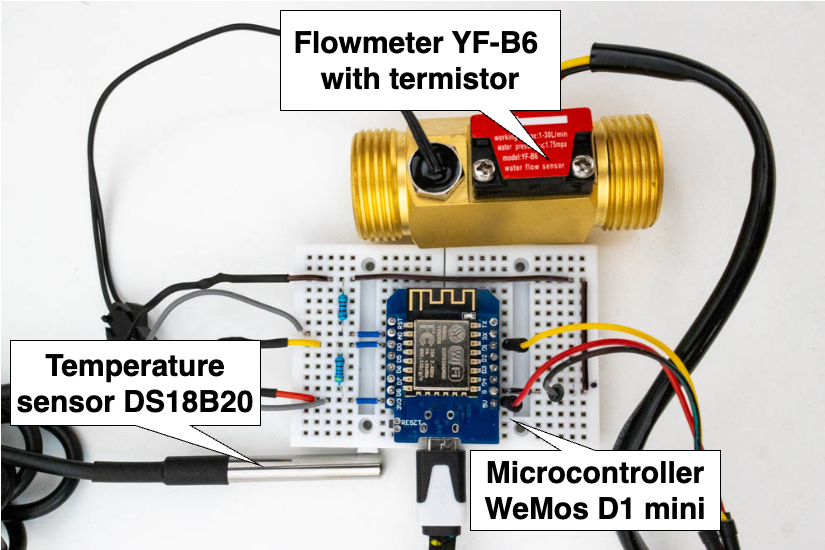

# Solution manual
There are a few essential steps that need to be followed to make a smart home solution that enables the use of machine learning for energy savings in the home operational. This is a manual with a description of the steps required for commissioning.
## Installing Home Assistant
Since my solution is provided as an add-on for the Home Assistant platform, the first step is to get the system up and running in the home. A decommissioned computer or a Raspberry Pi with an additional SSD can be used for this. The manual for commissioning can be downloaded from the official Home Assistant website: <https://www.home-assistant.io/installation/>.

## Getting the InfluxDB database up and running
After creating a Home Assitant instance, you need to install the InfluxDB add-on and create your own database. Again, the official manual for this integration can be used directly for this purpose: <https://www.home-assistant.io/integrations/influxdb/>.

After configuring the database, the following lines must then be added to the ```/homeassistant/configuration.yaml`` file within Home Assistant:

```
influxdb:
  host: HOST_NAME_OF_INFLUXDB
  port: 8086
  database: NAME_OF_DATABASE
  username: USERNAME
  password: PASSWORD
  max_retries: 3
  default_measurement: state
  ```

## Creating a sensor to collect boiler data
Since the successful collection of boiler heat consumption data and boiler water heating control requires the construction of a sensor to monitor these variables, the next step is to install the add-on using the ESPHome integration, see the manual <https://esphome.io/guides/getting_started_hassio.html>.
For this, a pre-made configuration file for this sensor can be used, which can be found in the file ``/source_codes/esphome_sensor.yaml``. 
The WeMos D1 Mini microcontroller, the YF-B6 flowmeter with thermistor and the waterproof version of the DS18B20 thermometer can be used to build the sensor, see the following diagram:

This flowmeter then needs to be installed as an intermediate connection to the boiler outlet pipe.

## Installing the Shelly smart relay
In order to switch the boiler heating, it is necessary to connect the power supply to the boiler through a smart relay or socket. The current version supports Shelly's smart relay which is one of the few that has its own API, power monitoring and support for sufficient power that is typically needed for water heating.
The Shelly Plus 1PM product can be used and can be placed in the boiler installation as follows:


This relay then needs to be connected to the local Wi-Fi network, which also contains the Home Assistant instance.

## Integration for Wi-Fi network monitoring
An essential variable for predicting consumption is the number of devices connected to the home Wi-Fi network. The following integration can be used for this purpose: https://www.home-assistant.io/integrations/nmap_tracker/

## Adding monitored devices
This solution also counts on the location data of up to two devices of the household occupants. You need to install the Home Assistant app on these and log into the Home Assistant instance. To access the location data online, a subscription to Home Assitant <https://www.home-assistant.io/cloud/> is required, which is approximately $70 per year and provides secure communication between the device and the system.

## Weather information
To obtain another variable used for estimating future consumption, weather, requires configuration of the AccuWeather integration, for which an API key must be obtained, but which is free when used for this purpose.
The manual to get it working can be found here: <https://www.home-assistant.io/integrations/accuweather/>.

## Installing the smartboiler-add-on add-on
After successfully completing the previous steps, there is nothing left but to install the add-on itself. This can be done by copying the repository link <https://github.com/grinwi/smartboiler-add-on> into the list of repositories under Add-ons for Home Assistant.
After successful installation, you need to fill in the household information in Settings as follows:

```
shelly_ip: IP address of the Shelly socket
boiler_socket_id: entity_id of the boiler socket (shelly)
data_measurement_date_start: date of start measuring data. YYYY-MM-DD
home_longitude: longitude of the household
home_latitude: latitude of the household
model_type: type of model - larger or smaller household
device_tracker_entity_id: entity id of the first device
device_tracker_entity_id_2: entity id of the second device
influxdb_host: host of InfluxDB database
influxdb_port: 8086
influxdb_user: username for InfluxDB
influxdb_pass: password for InfluxDB
influxdb_name: name of the InfluxDB database
boiler_water_flow_entity_id: entity ID of the flow sensor
boiler_water_temp_entity_id: entity ID of the outlet water temperature
boiler_water_temp_entity_id_2: entity ID of any second outlet water temperature sensor
boiler_volume: Boiler volume in liters
boiler_set_tmp: set temperature on the boiler thermostat - min 60 deg.
boiler_min_operation_tmp: minimum water temperature in the boiler during operation
average_boiler_surroundings_temp: average boiler surroundings temperature for conversion
boiler_watt_power: boiler power
logging_level: logging level
load_model: load pre-trained model
learning: first 4 weeks of learning and subsequent training
hdo: Is the boiler connected to a low tariff?
has_photovoltaics: does the household have PV?
fve_solax_sn: SN of Solax inverter
fve_solax_token: Solax Cloud Token

```

## Adding a Google Calendar token
To use the features associated with Google Calendar, you need to insert the token.json file into the /app directory within the add-on.
The token for Google Calendar can be obtained using this tutorial: <https://developers.google.com/calendar/api/quickstart/python>
This can then be copied into the add-on directory using Portainer: <https://community.home-assistant.io/t/home-assistant-community-add-on-portainer/68836>.

You can then just add events to the calendar with 
- the string ``#off`` in the name when the water in the boiler will not be heated for the duration of the event,
- with the string ``heat water at TEMPERATURE_CELSIUS degrees``, where the water in the boiler will be heated to ``TEMPERATURE_CELSIUS`` for the duration of the event.
